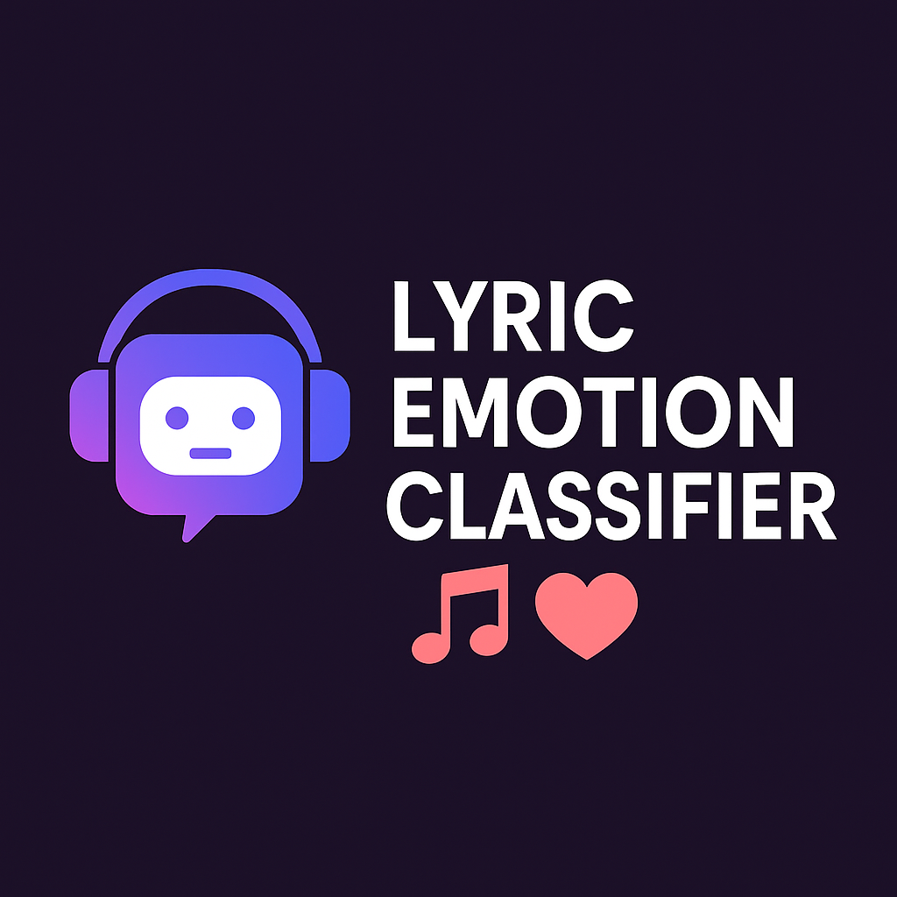

<h1 align="center">🎵 <u>Lyric-Emotion-Classifier-with-BERT</u> 🎵</h1>

<h2 align="center">
  <i>Final project for the Technion's EE Deep Learning course (046211)</i>
</h2>

<h3 align="center">
  <strong>Nir Voloshin</strong> & <strong>Yuri Minin</strong>
</h3>

## Table of Contents
1. [Introduction](#introduction)
2. [Goals](#goals)
3. [Our Model](#our-model)
   1. [Architecture Overview](#architecture-overview)
   2. [Fine Tuning](#fine-tuning)
5. [Dataset](#dataset) 
6. [Experimental Setup](#experimental-setup)
7. [Results](#results)
8. [Conclusions](#conclusions)
9. [Future Work](#future-work)
10. [How To Run](#how-to-run)

## Introduction
BERT (Bidirectional Encoder Representations from Transformers) is a transformer-based model pre-trained on large corpus. 
It captures deep bidirectional context-aware representations for tokens in a sentence and is widely used as a base model for transfer learning in natural language processing (NLP).

BERT is typically fine-tuned for downstream tasks by adding task-specific layers on top of its pre-trained architecture. Depending on the nature of the task (classification, regression, sequence labeling), different outputs of the BERT model are used.

In this project, we employ BERT for sentences-level emotion regression, where the input is a chunk of song lyrics and the output is a continuous-valued emotion score between 0-1 (e.g., valence). 

By leveraging pretrained language models such as BERT, we seek to improve the understanding of emotional nuance in musical language. This approach has the potential to enhance music recommendation systems and at the end, our work opens the door to multimodal extensions that integrate audio, metadata, and listener feedback for richer emotion modeling.

## Goals

  

* Achieving well performance for our model.
  
* Improving performance compared to basic neural network.

## Our Model
Our model is based on the BERT-base architecture. The model takes as input a tokenized segment (chunk) of lyrics and outputs a continuous valence score representing the emotional content of the text.

### Architecture Overview:
* Backbone: bert-base-uncased pretrained language model (12 layers, 768 hidden size)
* Input: Full lyrics are segmented into overlapping text chunks to respect BERT’s maximum sequence length of 512 tokens. --    - Distribution of chunks per sample is shown in the histogram below. Some samples were even split into 11 chunks.
   - Each chunk  is generated with a fixed stride to maintain context continuity.
   - Each chunk is processed independently by BERT.
   - For each original lyric (song), the final valence prediction is obtained by averaging the predictions from all chunks        belonging to the same lyric.
* Regression Head: A two-layer feedforward network:
  Linear(768 → 128) → ReLU → Linear(128 → 1)
  

### Fine Tuning:
To efficiently fine-tune BERT on our dataset, we incorporate Low-Rank Adaptation (LoRA), a parameter-efficient transfer learning method. LoRA is used to inject trainable low-rank matrices into linear layers (e.g., in self-attention).
In our setup, LoRA is applied to the query and value projection layers of BERT's self-attention modules in the final 4 layers (layers 9–12).

### Model Flowchart

## Dataset
### 150K Lyrics Labeled with Spotify Valence
* Source: [Kaggle - Valence-labeled Lyrics](https://www.kaggle.com/datasets/edenbd/150k-lyrics-labeled-with-spotify-valence/)
* Details: The dataset consists of approximately 150,000 song lyrics from a wide range of artists. Each entry includes:
  artist name, full lyrics, song title, and valence score provided by Spotify representing the emotional positivity of the track.

   
## Experimental Setup
The model wasn't trained on the entire dataset due to hardware limitations. We took 30,000 samples out of the dataset.
The dataset the model was trained on :

* Training Dataset Size: 24,000 samples
* Validation\Test Dataset Size: 3,000 samples
* Batch Size: 32
* Learning Rate: 2e-5
* Num of epochs: 20

## Results
To evaluate the effectiveness of our approach, we compared our fine-tuned model to a baseline regressor that uses the same BERT-generated token embeddings as input to a simple MLP network.

### The results for the two methods are as follows:

Baseline (MLP) Loss plots

Fine-tuned BERT Loss plots

|Method      | MSE on test set|
|-------------|---------|
|baseline|   0.0517|
|proposed method|   0.0486|

## Conclusions
1. Fine-tuned BERT model with LoRA adaptation achieved slightly better performance compared to the baseline MLP model.
2. The overall prediction performance was not as strong as expected.
3. Our suggested model struggled to fully capture the complexity of emotional expression in lyrics, indicating that valence prediction from text alone may be inherently limited — or that further architectural enhancements and richer multi-modal features (e.g., audio) may be needed.

  

## Future Work
As mentions previously, future work could explore incorporating multi-modal inputs, such as audio features or acoustic embeddings, alongside lyrics. These additional modalities may help the model better capture the emotional nuances that are difficult to infer from text alone. 
However, pursuing this direction would require a suitable dataset that includes both lyrics and corresponding audio, along with reliable valence annotations.

## How To Run
1. Popularity_Analysis.ipynb – Contains the full training process and evaluation. You can modify hyperparameters and load previously trained models.
2. Trained_models/ – Stores pre-trained models, including naive and optimized combined models.
3. datasets/ – Contains a small dataset of 150 samples for testing. The full dataset (~3,000 samples) couldn't be uploaded due to storage limitations.
   * Files are in pickle format (.pkl), which must be loaded in the notebook's initial cells.
4. dataset_generations/ – Includes scripts for:
   * Generating down-sampled spectrograms (~3k samples).
   * Preprocessing the Spotify dataset (~550k samples).
   * If needed, you can use the Kaggle API JSON file to fetch datasets.

1. From the link in dataset section download the file GOLD_XYZ_OSC.0001_1024.hdf5 into directory named 'dataset'.
2. Run data_preprocessing.py, located in the data_set_preprocessing directory.
3. Run RF_fingerprints.ipynb.

  

